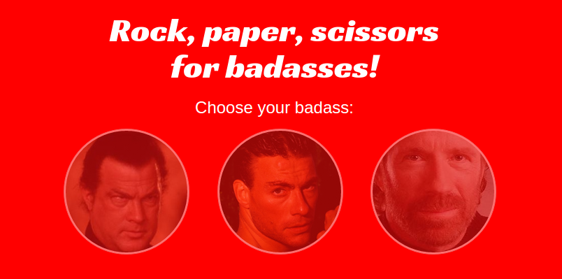

# Rock, paper, scissors for badasses!



Choose your badass and play against computer!

## Requirements
To develop, serve and build this project you need node.js and `bower` and `gulp` installed globally.

```bash
$ npm install -g bower
$ npm install -g gulp
```

To run tests you need also `karma-cli` installed globally:

```bash
$ npm install -g karma-cli
```

## Installation

Install node modules and bower dependencies:

```bash
$ npm install
$ bower install
```

## Develop while playing

Run task

```bash
$ gulp serve
```

This task creates a folder named 'build' inside the project, it is removed and created everytime you run `serve`. If you open your browser at

[http://localhost:12345](http://localhost:12345)

you can play with the game.

If you need to make changes or fix bugs, just modify files inside `src` folder: every change is reflected inside `build` folder and the game is reloaded inside the browser.

### Javascript

Main application file is located at `src/js/app.js`. It describes the **AngularJS** application of the game.

### Styles

**Bootstrap** is the chosen frontend package. For simpliciy you can override **Bootstrap** styles inside `src/less/app.less` file, it is compiled down to CSS at every change and moved to `build/css` folder.

## Build

To build project, run task

```bash
$ gulp build
```

This task is the same as `serve` BUT it does not start the webserve and it does not watch `src` files for changes.

You can publish `build` folder content wherever you want!

## Test

To run test, run script

```bash
$ npm run test
```

Unit testing environment is **Karma runner**, while the unit testing framework is **Jasmine**. Tests run inside **Chrome browser**.

## Todo

- Better responsive layout.
- Javascript minification for production.
